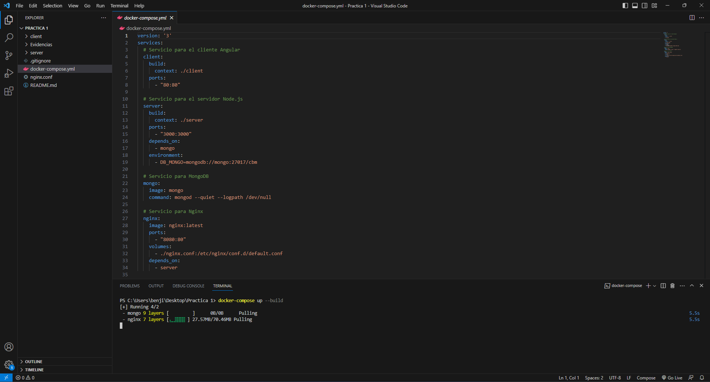
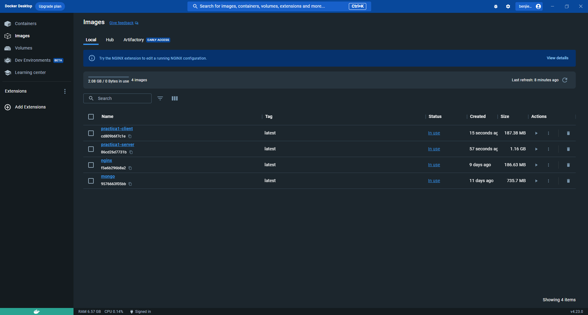
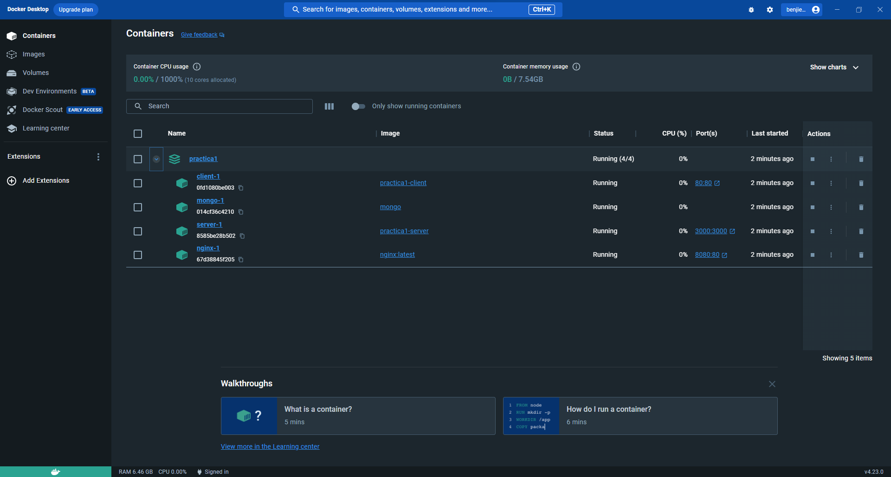
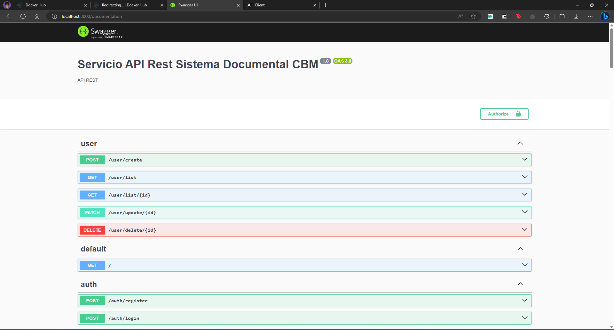
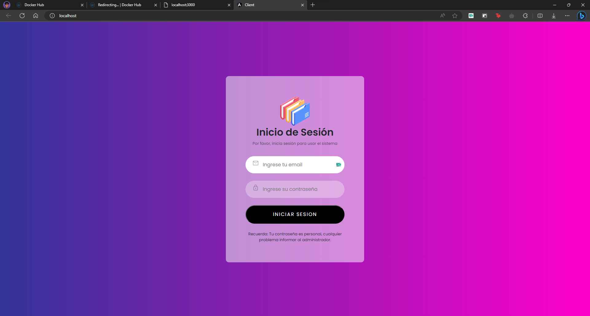

# Practica 1
# Diagrama Entidad Relacion:

# Definimos como base de datos Mongo, por el momento, como podemos ver en el back ya se estructuro de una vez todas las entidades que forman parte del diagrama entidad relacion anterior.

# En el front en este caso angular hicimos uso de las entidades que tienen dos relaciones con otras entidades, en este caso como se menciono en clase no era necesario aplicar todas las rutas de la apu rest, con el get bastaba, entonces se definieron las respectivas interfaces que nos presentan unas tablas con esta informacion.
# Usuarios:

# Documento:

# Departamentos:

# Flujo de Procesos:

# Proceso Determinado:

# Solicitud Baja:

# El proceso de dockerizacion es el siguiente, Luego de haber creado ambos dockerfiles tanto en el server como en el client en nuestro  docker-compose tendremos que configurar los respectivos servicios que necesitamos entre los cuales se encuentran la creacion de las imagenes del server y el client que para eso se usan los dockersfiles, asi mismo como vamos a usar nuestra base de datos en mongo tambien tendremos que configurarla. Luego con el comando:
```bash
docker-compose up --build   
```

# Eso nos va a generar las imagenes respectivas y va a usarlas en el respectivo container que acabamos de crear:



# Entonces comprobamos que solo haciendo eso podemos usar tanto el forntend como el backend:


