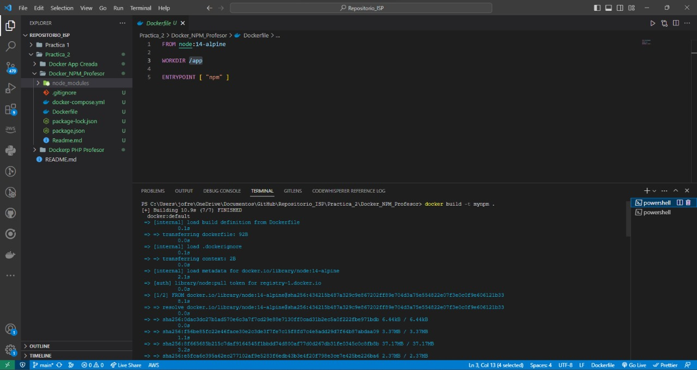

# Para empezar, escribimos el comando para trabajar con el DockerFiler que se nos otorgo para esta practica, este comando lo que hara sera crearnos nuestra imagen

```bash
docker build -t mynpm .
```



# Continuamos con el segundo comando lo que hara sera que tando de manera local como en nuestro contenedor haciendo uso de la imagen nos va a iniciar el proyecto.

```bash
docker run -it -v  [local folder]:/app mynpm init
```


# Asi mismo podemos instalar las dependencias que vayamos a usar como por ejemplo express, etc
.
```bash
docker run -it -v [local folder]:/app mynpm install express --save
```


# Como tambien instalar todo los node_modules, como estamos usando el comando docker run lo que nos esta haciendo es generando un nuevo contenedor al momento de ejecutar cada comando

```bash
docker run -it -v [local folder]:/app mynpm install
```


# Asi mismo si ya se tiene armado el Docker Compose este brindará una mayor facilidad para el acceso a instrucciones pre establecidos.
```bash
docker-compose run npm init 
```


# Como podemos observar las funciones son las mismas la unica diferencia es que como en el comando estamos poniendo el parametro --rm este contenedor que se esta creando se eliminara una vez se finalice que como vimos anteriormente se finalizan a lo que terminan la tarea que se les asigno
```bash
docker-compose run --rm npm init 
docker-compose run --rm npm install 
```

