# Practica 4
# Diagrama Entidad Relacion:

# 1. Aplicar servicio REST (aplicar por lo menos 2 métodos del CRUD) basado en la entidad transaccional asignada en su trabajo autónomo.
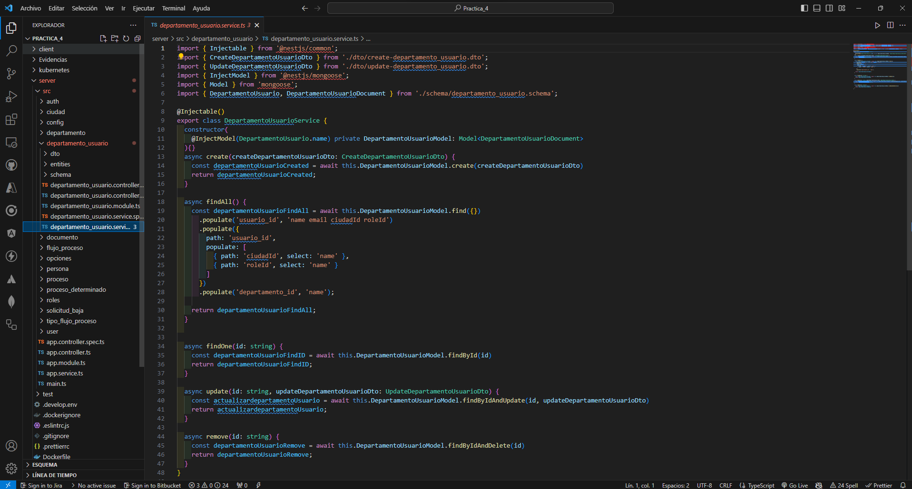
# 2. Instalar minikube sobre Docker https://minikube.sigs.k8s.io/docs/start/
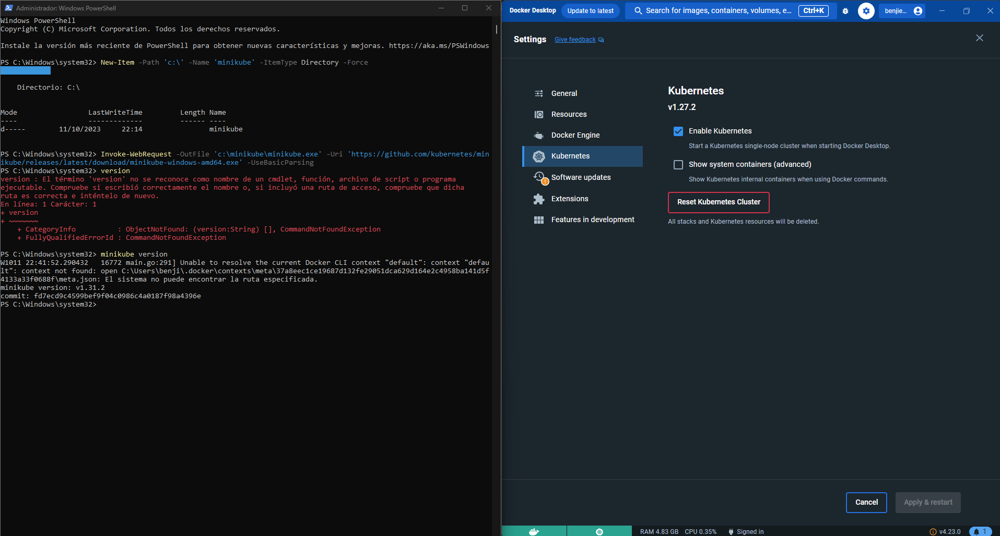
# 3. Definir configuraciones y secretos para los parámetros de su base de datos y servicio REST.
##  backend-secrets
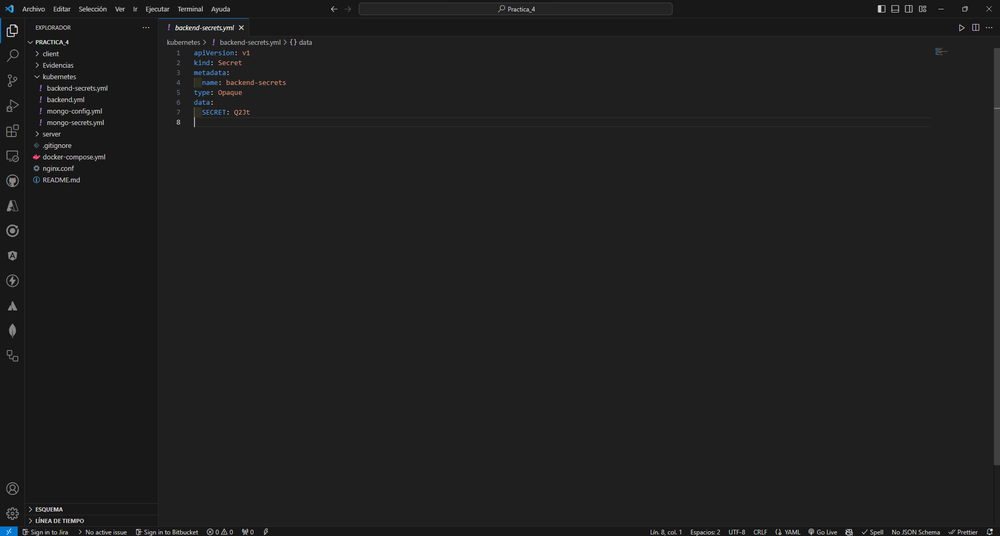
##  mongo-secrets
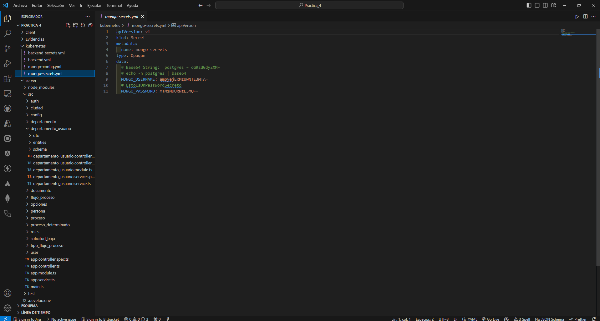
##  mongo-config
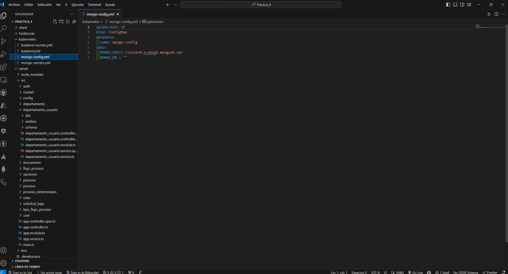
# 4. Definir el Deployment y el Service para levantar su base de datos.
# 5. Definir el Deployment y el Service para levantar su servicio REST.
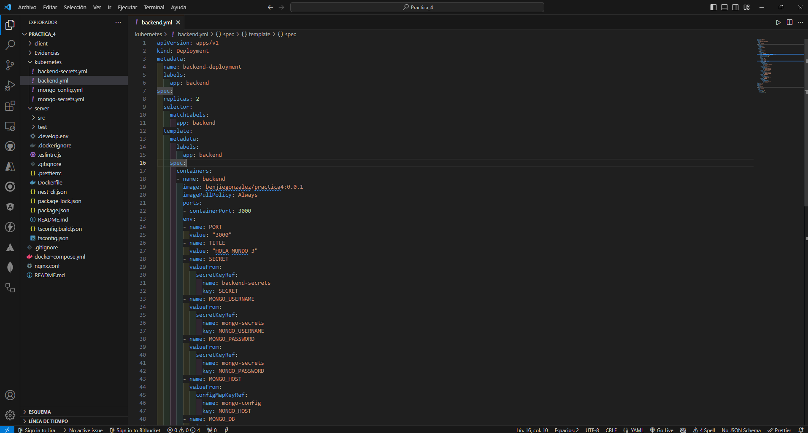
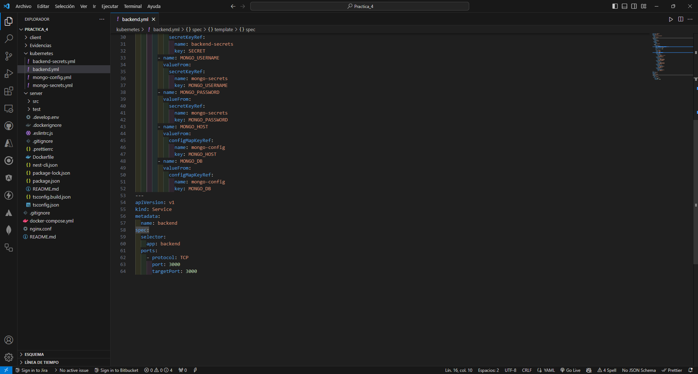
# 6. Aplicar los siguientes comandos para aplicar su configuración con minikube:
## a. kubectl apply -f [file-name].yml para aplicar un archivo específico a la configuración.
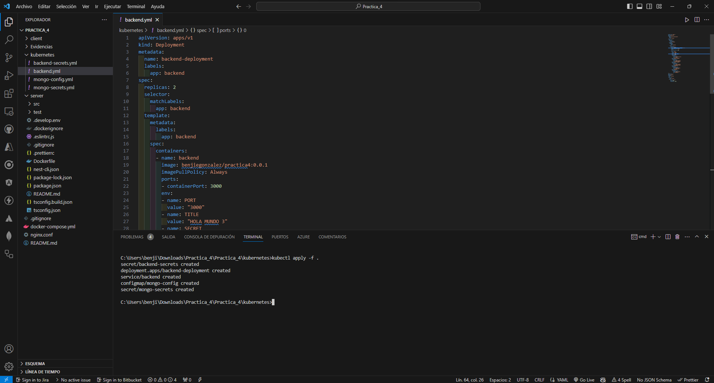
## b. kubectl get all para mostrar el estado de su configuración.
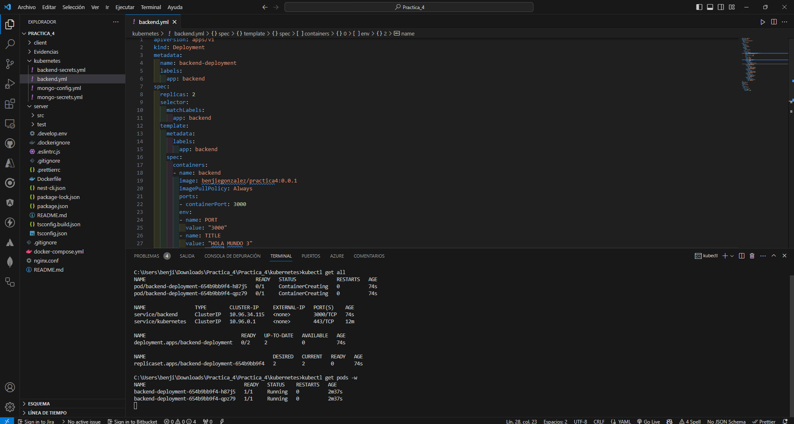
## c. kubectl logs pod/[name-pod] para obtener los logs de un elemento específico.
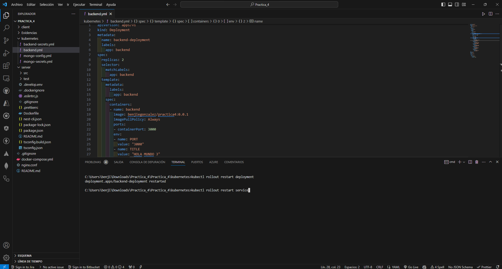
## e. kubectl rollout restart deployment aplicar cambios en general a la configuración de deployments o services con kubectl rollout restart service.
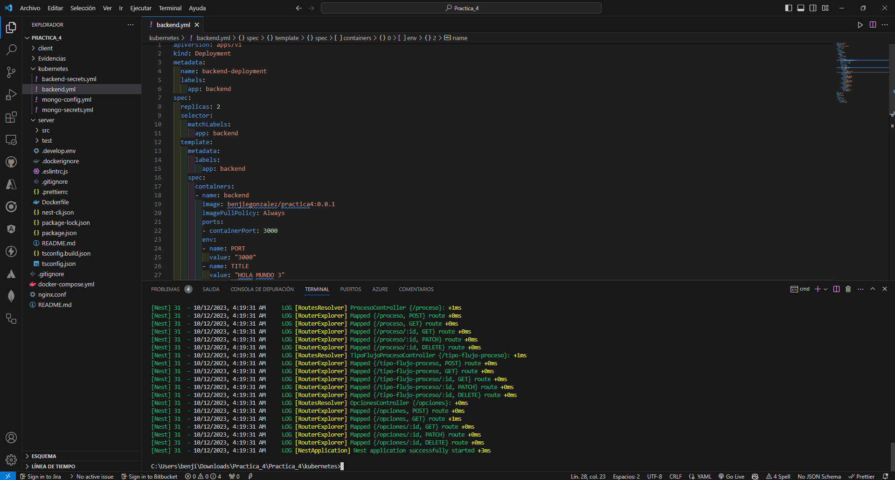
## f. minikube service backend-service cuando desee exponer el servicio para poder probarlo. o en su variante se puede usar: 
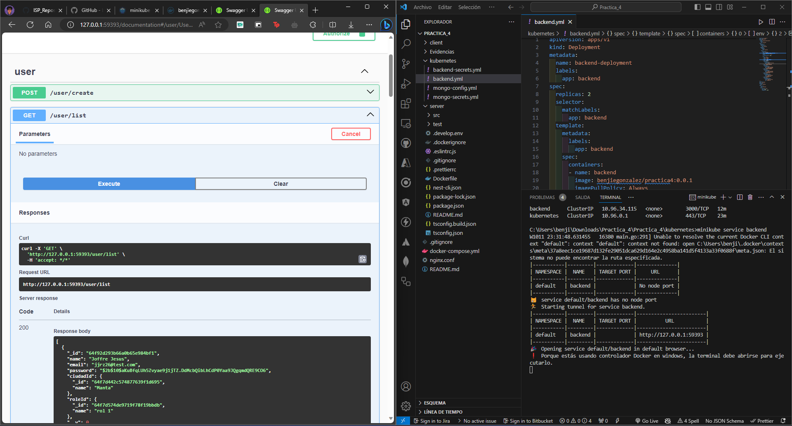
